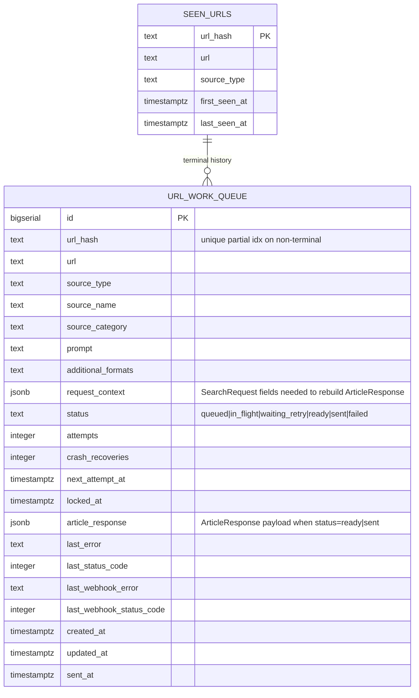

# Content-Sourcing URL Work Queue (Fully Async + Webhook Reconciliation)

## Overview

Introduce a durable, crash-resilient URL work queue inside `syntech-content-sourcing` that decouples discovery from extraction. `POST /search` becomes a fast discover-and-enqueue endpoint; a single background `drain_loop` extracts articles asynchronously; when the queue settles, the drainer flushes a batch of `ArticleResponse` objects to a new n8n webhook (`/webhook/flush-syntech-queue`) that rejoins the existing classifier → Notion → Slack chain. Pattern is ported wholesale from the proven `classifier.dashboard_sync_outbox` + `drain_loop` in `syntech-article-classifier`.

This eliminates request-timeout-driven URL loss, guarantees same-day delivery for the daily schedule, scales from 50 to 2,500-URL runs without code changes, and survives Railway restarts mid-run.

## Problem Statement

A single `/search` call today does URL discovery (Apify/Tavily/SERP/RSS) **and** per-URL HTML fetch + article extraction inside one synchronous HTTP request. Problems:

1. **Timeouts drop URLs silently.** A 100-URL fresh-keyword run, or a 2,500-URL cross-source run, exceeds any reasonable HTTP timeout long before extraction completes. Unprocessed URLs are dropped from the response. PR #7 (test-mode dedup fix) ensures they're re-eligible on next run — but the next run is 24h away.
2. **No same-day recovery.** The daily Schedule trigger is the only thing that re-surfaces dropped URLs, so important news on the drop day is delayed a full day.
3. **Raising timeouts masks the problem.** The cap reappears as soon as batch size grows.
4. **No crash resilience.** A Railway restart mid-extraction drops everything in flight; nothing is persisted beyond the successful-response path.
5. **Two overlapping code paths.** `/search` and `/search/batch` duplicate the per-URL extraction logic.

The root cause is that extraction lives in the request path. The fix is to persist every URL before extracting, extract asynchronously, and reconcile into the existing downstream via a webhook — `(see origin: docs/brainstorms/2026-04-23-sourcing-url-work-queue-requirements.md#problem-frame)`.

## Execution Decisions (2026-04-23 Q&A with Stephen)

Locked-in choices that supersede earlier "Deferred to Implementation" notes in this plan:

| # | Decision | Rationale |
|---|----------|-----------|
| D1 | **Ship the new `/search` response shape, no version discriminator.** `{status, queued, skipped_dedup}` is terminal. | Microservice is internal; all callers under Stephen's control. |
| D2 | **Retire `/search/batch` entirely in this PR.** No alias. Useful logic folds into `/search`. | Simpler; no dual path. |
| D3 | **Backoff schedule shortened**: `{1:10s, 2:30s, 3:2m, 4:10m, 5:30m}`. **`MAX_ATTEMPTS=6`** (env-configurable). Max span ~42min before dead-letter. | Same-day delivery SLA; sourced content decays fast. |
| D4 | **All relevant knobs surfaced as env vars** — `MAX_ATTEMPTS`, `DISCOVERY_TIMEOUT_*` per source, `FLUSH_SETTLE_SEC`, `FLUSH_MAX_WAIT_SEC`, `DRAIN_POLL_INTERVAL_SEC`, `DRAIN_BATCH_SIZE`, `STALE_LOCK_SEC`, `STALE_LOCK_CHECK_INTERVAL_SEC`, `WEBHOOK_URL`, `WEBHOOK_BEARER_TOKEN`, `WEBHOOK_TIMEOUT_SEC`, `QUEUE_ENABLED`. | Runtime tuning without redeploy. |
| D5 | **`QUEUE_ENABLED=true` by default.** The old synchronous path is removed with `/search/batch` retirement; the flag is a kill-switch only. | Queue is the product, not a feature flag. |
| D6 | **Webhook envelope matches the legacy `/search/batch` response shape** — `{"status":"success", "articles":[...], "articles_returned":N, "sources_processed":N, "sources_failed":N, "errors":null}`. Additional optional metadata per the microservice needs. | Minimises n8n-side changes; Stephen's existing downstream expects this shape. |
| D7 | **Ship `POST /admin/queue/requeue` in v1.** Bearer-gated. | High ops value, cheap to build. |
| D8 | **Integration tests run against a Neon branch-per-PR.** Not testcontainers-postgres. | Production-parity `SKIP LOCKED` + pooler SSL behavior. |
| D9 | **One PR per repo.** content-sourcing: `feat/url-work-queue`. n8n-as-code: `feat/sourcing-url-work-queue`. | Simple review. |
| D10 | **Stephen publishes the n8n workflow himself.** Agent delivers the `.workflow.ts` edits + explicit step-by-step n8n UI instructions, then pauses before live tests. | Stephen's rule for this repo. |
| D11 | **Webhook envelope spike before Phase 7 cutover.** Throwaway test POST against a temporary n8n Webhook trigger to confirm `$json.body.articles` unwraps cleanly. | Per origin doc Finding #11. |

### Legacy Batch Request Shape (archived for reference, used by Phase 6 swap instructions)

The current n8n `CallContentSourcingBatch` node sends:

```jsonc
{
  "sources": [
    {
      "source_type": "...",
      "url_or_keyword": "...",
      "source_name": "...",
      "source_category": "...",
      "prompt": "...",
      "additional_formats": "...",
      "test_mode": true
    }
    // ...one entry per source...
  ],
  "max_concurrent_apify": 3
}
```

**Post-cutover replacement** (see Phase 6): the same node loops per source and calls `POST /search` once per source with the item fields flat:

```jsonc
{
  "source_type": "...",
  "url_or_keyword": "...",
  "source_name": "...",
  "source_category": "...",
  "prompt": "...",
  "additional_formats": "...",
  "test_mode": true
}
```

Stephen makes this n8n UI change manually; agent provides the exact node config in Phase 6 deliverables.

## Proposed Solution

**Port the classifier's outbox pattern to content-sourcing**, with a state-based flush predicate tuned for batch sourcing:

1. New Neon table `content_sourcing.url_work_queue`. Every URL that enters the system is persisted with enough context to reconstruct an `ArticleResponse`. State machine: `queued` → `in_flight` → (`ready` | `waiting_retry` | `failed`); `ready` → `sent` (or back to `ready` on transient webhook failure).
2. `POST /search` becomes discover-and-enqueue. Returns `{status: "queued", queued: N, skipped_dedup: M}` — no articles array.
3. **`/search/batch` is retired entirely in this PR** (per D2). Any still-useful logic (e.g. per-source fanout, `max_concurrent_apify` cap) lives in `/search` or in the n8n side as a per-source loop.
4. A `drain_loop` spawned from the FastAPI lifespan polls the queue every ~1s, claims batches with `FOR UPDATE SKIP LOCKED`, extracts in parallel, and routes outcomes through the state machine.
5. **Flush predicate:** when `queued=0 AND in_flight=0 AND ready>0`, start a 30s settle timer. On expiry, flush all `ready` rows in a single POST to the n8n webhook. Re-entering the predicate cancels the timer. A hard `FLUSH_MAX_WAIT_SEC` ceiling forces a flush if persistent churn delays it.
6. Webhook POST uses `httpBearerAuth` header matching existing n8n convention; 2xx → `sent`, transient → revert batch to `ready`, permanent → dead-letter batch to `failed`.
7. Admin endpoints (`/admin/queue/status`, `/admin/queue/failed`, `/admin/queue/requeue`) bearer-gated for ops introspection.
8. n8n workflow gets a new `Webhook` trigger node at `/webhook/flush-syntech-queue` that rejoins the canonical classifier → Notion → Slack chain; the Schedule trigger side becomes discovery-only.

## Technical Approach

### Architecture

```
┌──────────────────────────────────────────────────────────────────────┐
│ n8n "News Sourcing Production (V2)"                                  │
│                                                                      │
│   [ScheduleTrigger] → GetAllSources → MapToContentSourcing           │
│           │                                                          │
│           ▼                                                          │
│   [CallContentSourcing POST /search]  (returns {queued, skipped})    │
│           │                                                          │
│           ▼                                                          │
│       (no-op: no articles to process)                                │
│                                                                      │
│   [WebhookTrigger /webhook/flush-syntech-queue]                      │
│           │                                                          │
│           ▼                                                          │
│       SplitOutArticles → classifier → Notion → Slack                 │
└──────────────────────────────────────────────────────────────────────┘
                                  ▲
                                  │ single POST per flush
                                  │ { articles: [ArticleResponse, ...] }
                                  │
┌──────────────────────────────────────────────────────────────────────┐
│ syntech-content-sourcing (FastAPI on Railway)                        │
│                                                                      │
│   POST /search (discover + enqueue, fast)                            │
│     │                                                                │
│     ▼                                                                │
│   [url_work_queue] ── atomic claim (FOR UPDATE SKIP LOCKED) ──┐      │
│     ▲                                                         │      │
│     │                                                         ▼      │
│     │                                              ┌──────────────┐  │
│     │                                              │  drain_loop  │  │
│     │   reschedule (waiting_retry)  ◀──────────────┤   (async)    │  │
│     │                                              └──┬───────────┘  │
│     │   flush predicate true + 30s settle              │             │
│     │                                                  ▼             │
│     └──────── POST webhook ─────────────  ready → sent | failed      │
└──────────────────────────────────────────────────────────────────────┘
```

### Data Model



Key indices:
- `UNIQUE INDEX idx_url_work_queue_url_hash_active ON url_work_queue (url_hash) WHERE status IN ('queued','in_flight','waiting_retry','ready')` — enforces enqueue-time dedup; `sent`/`failed` rows do not block re-enqueue (policy consistent with `seen_urls`, see Finding #3).
- `INDEX idx_url_work_queue_claim ON url_work_queue (next_attempt_at) WHERE status IN ('queued','waiting_retry')` — hot path for drainer claim.
- `INDEX idx_url_work_queue_in_flight ON url_work_queue (locked_at) WHERE status = 'in_flight'` — stale-lock recovery.
- `INDEX idx_url_work_queue_status ON url_work_queue (status)` — admin count query.

### State Machine

```
   ┌────────┐   claim (SKIP LOCKED, attempts++)   ┌───────────┐
   │ queued │─────────────────────────────────────▶│ in_flight │
   └────────┘                                      └─────┬─────┘
        ▲                                                │
        │ stale-lock (>STALE_LOCK_SEC, crash_recoveries++)│
        │                                                │
        │          ┌─── extract transient ◀──────────────┤
        │          ▼                                     │
        │   ┌──────────────┐   next_attempt_at ≤ now()   │
        │   │ waiting_retry│──────── claim ──────────────┤
        │   └──────────────┘                             │
        │                                                │
        │                                   extract ok ◀─┤
        │                                   ┌────────┐   │
        │                                   │ ready  │◀──┤
        │                                   └───┬────┘   │
        │                                       │        │
        │                             ┌─── flush│fires   │
        │                             ▼         │        │
        │   webhook 2xx          ┌───────┐      │        │
        │─────────────────────── │ sent  │      │        │
        │                        └───────┘      │        │
        │                                       │        │
        │                                       │        │
        │   webhook transient: ready (same row batched next tick)
        │                                                │
        │                                       ├─ extract permanent
        │   webhook permanent (dead-letter)     ▼        │
        │                                   ┌────────┐   │
        └───────────────────────────────────│ failed │◀──┘
                                            └────────┘
```

Rules:
- `sent` and `failed` are terminal.
- On stale-lock recovery: `in_flight → queued` (fresh row, never extracted) or `in_flight → waiting_retry` (previously retried). `attempts` is **left incremented** (conservative, treat crash as a failed attempt); a separate `crash_recoveries` counter is incremented for visibility but does not count toward `MAX_ATTEMPTS` (see Finding #7).
- On webhook transient: `ready → ready` (no state change; whole batch re-flushes on next tick). `last_webhook_error`/`last_webhook_status_code` updated per row so ops can distinguish "fresh ready" from "webhook-retry ready" in `/admin/queue/failed?state=ready_stuck` (see Finding #2).

### Flush Predicate & Settle Timer

```python
def predicate_true(counts: dict[str, int]) -> bool:
    return counts["queued"] == 0 and counts["in_flight"] == 0 and counts["ready"] > 0
```

Settle-timer implementation: single-tick check against elapsed time (not a separate asyncio timer task — simpler, no cancellation bugs). The drainer carries state `settle_started_at: datetime | None`. On every tick:

1. Compute `counts` via a single `SELECT status, count(*) GROUP BY status`.
2. If `predicate_true(counts)`:
   - If `settle_started_at is None`, set it to `now()`. Emit `flush_settle_started`.
   - If `now() - settle_started_at >= FLUSH_SETTLE_SEC`, fire flush. Reset `settle_started_at`. Emit `flush_fired`.
   - If `now() - settle_started_at >= FLUSH_MAX_WAIT_SEC`, **force-fire** flush (prevents churn starvation, see Finding #4). Emit `flush_fired_max_wait`.
3. Else (predicate false):
   - If `settle_started_at is not None`, clear it. Emit `flush_settle_cancelled`.

This handles Finding #4 without a separate timer-task lifecycle.

### Enqueue Path (`POST /search`)

```python
async def search(request: SearchRequest, ...) -> SearchResponse:
    # 1. Discovery (sync, as today) — wrap in asyncio.wait_for(DISCOVERY_TIMEOUT_SEC) per-source
    urls = await asyncio.wait_for(
        discovery_handler.discover(request),
        timeout=settings.discovery_timeout_sec_for(request.source_type),
    )
    # 2. Normalize + dedup-check against seen_urls AND active url_work_queue rows
    url_hashes = {u: hash_url(normalize_url(u)) for u in urls}
    seen_or_active = await db.check_url_seen_or_active(url_hashes.values())
    fresh = [u for u in urls if url_hashes[u] not in seen_or_active]
    # 3. Bulk-insert into url_work_queue, ON CONFLICT (url_hash) WHERE active DO NOTHING
    inserted = await db.enqueue_bulk(fresh, request)  # returns actual inserted count
    return {"status": "queued", "queued": inserted, "skipped_dedup": len(urls) - inserted}
```

The `ON CONFLICT ... DO NOTHING` against the active-state unique partial index is the race-safe final dedup gate (Finding #3). A concurrent enqueue that slipped past the SELECT will be absorbed by the index and counted as `skipped_dedup`.

### Drainer Skeleton

Ported from `/Users/sanindo/syntech-article-classifier/app/dashboard_sync.py:450-548`:

```python
async def drain_loop() -> None:
    if not settings.queue_enabled:
        logger.info("drain_loop.disabled")
        return
    poll = max(0.25, settings.drain_poll_interval_sec)
    settle_started_at: datetime | None = None
    last_stale_lock_check = datetime.now(UTC)
    await recover_stale_locks()  # startup sweep
    while True:
        try:
            rows = await claim_batch(limit=settings.drain_batch_size)
            if rows:
                results = await asyncio.gather(
                    *(extract_one(row) for row in rows), return_exceptions=False
                )
                for row, result in zip(rows, results):
                    await dispatch(row, result)  # → ready | waiting_retry | failed
            # flush predicate check (independent of claim result)
            settle_started_at = await check_and_flush(settle_started_at)
            # periodic stale-lock sweep inside the loop
            if datetime.now(UTC) - last_stale_lock_check >= timedelta(
                seconds=settings.stale_lock_check_interval_sec
            ):
                await recover_stale_locks()
                last_stale_lock_check = datetime.now(UTC)
            await asyncio.sleep(poll)
        except asyncio.CancelledError:
            raise
        except Exception:
            logger.exception("drain_loop.tick_failed")
            await asyncio.sleep(5)
```

Claim SQL (identical pattern to classifier):

```sql
UPDATE content_sourcing.url_work_queue
SET status = 'in_flight', locked_at = now(), attempts = attempts + 1
WHERE id IN (
  SELECT id FROM content_sourcing.url_work_queue
  WHERE status IN ('queued', 'waiting_retry') AND next_attempt_at <= now()
  ORDER BY next_attempt_at ASC, created_at ASC
  LIMIT %s
  FOR UPDATE SKIP LOCKED
)
RETURNING id, url, url_hash, source_type, source_name, source_category,
          request_context, attempts
```

Backoff schedule (tightened from the classifier's per Decision D3 — content decays fast; full span < 1h):

```python
def compute_backoff_sec(attempts: int) -> int:
    # attempt 1 → 10s, 2 → 30s, 3 → 2min, 4 → 10min, 5+ → 30min
    return {1: 10, 2: 30, 3: 120, 4: 600}.get(max(1, attempts), 1800)
```

Dead-letter at `MAX_ATTEMPTS` (default **6**, env-configurable via `MAX_ATTEMPTS`). Worst-case URL lifetime: `10 + 30 + 120 + 600 + 1800 + 1800 = 4360s ≈ 72min` before dead-letter — comfortably inside a daily schedule tick and below the classifier's 50-attempt marathon.

### Error Classification (Extraction)

Per `(see origin: #r17)`:

| Outcome | Classification | Terminal state |
|---------|----------------|----------------|
| 404, 410, hard 403, content validation failure, garbled/anti-bot junk past Zyte fallback | Permanent | `failed` |
| Network error, 5xx, 429, timeout, IP-rate-limit (pre-fallback) | Transient | `waiting_retry` with `next_attempt_at = now() + compute_backoff_sec(attempts)` |

Handlers **never raise** out of `extract_one`; every outcome is mapped deterministically. Exceptions are caught at the `extract_one` boundary and re-classified as transient (conservative) with `last_error = repr(exc)`.

### Webhook Delivery

Webhook payload shape — per Decision D6, matches the legacy `/search/batch` response envelope so the n8n downstream needs minimal rewiring:

```python
async def flush_once(ready_rows: list[QueueRow]) -> FlushResult:
    payload = {
        "status": "success",
        "articles": [row.article_response for row in ready_rows],
        "articles_returned": len(ready_rows),
        # Source-level counters computed from the batch's distinct source_name values:
        "sources_processed": len({r.source_name for r in ready_rows}),
        "sources_failed": 0,  # Flush only fires on ready rows; failed rows already dead-lettered.
        "errors": None,
        # Queue-native metadata (new):
        "flush_id": str(uuid4()),            # idempotency key for n8n side
        "queue_row_ids": [r.id for r in ready_rows],
    }
    async with httpx.AsyncClient(timeout=settings.webhook_timeout_sec) as client:
        try:
            resp = await client.post(
                settings.webhook_url,
                json=payload,
                headers={"Authorization": f"Bearer {settings.webhook_bearer_token}"},
            )
        except (httpx.TimeoutException, httpx.NetworkError) as exc:
            return FlushResult.transient(str(exc), None)
    if 200 <= resp.status_code < 300:
        return FlushResult.success(resp.status_code)
    if resp.status_code in (429,) or 500 <= resp.status_code < 600:
        return FlushResult.transient(resp.text[:500], resp.status_code)
    return FlushResult.permanent(resp.text[:500], resp.status_code)
```

Outcome dispatch:
- `success` → all batch rows `ready → sent` with `sent_at = now()`, `last_status_code` set, `last_webhook_error` cleared.
- `transient` → all batch rows stay `ready`, `last_webhook_error` + `last_webhook_status_code` stamped. Next drainer tick re-enters flush predicate and retries the whole batch. Use the same backoff schedule keyed off a per-row `webhook_attempts` counter (reset on batch success).
- `permanent` → all batch rows `ready → failed`, `last_error` + `last_status_code` stamped. Alerting should page on first `webhook_post_permanent` event (Finding on R14).

### URL Normalization & Dedup

Reuse existing `app/dedup.py:44-95` (`normalize_url` + `hash_url` SHA256). The brainstorm's parent-microservice deferred question (R9 there) is still unresolved for *global* normalization; this plan does not escalate it — the `url_work_queue` uses the same `hash_url` as `seen_urls`, so the two tables remain consistent. Any future normalization change lands in `dedup.py` and affects both atomically.

### Discovery Timeout Guard

Per-source timeout (Finding #8):

```python
DISCOVERY_TIMEOUT_SEC = {
    "RSS": 30,
    "Website": 30,
    "Google": 30,
    "Keyword": 60,      # Tavily/Perplexity
    "LinkedIn": 120,    # Apify
    "Instagram": 120,   # Apify
    "X": 120,           # Apify
}
```

On timeout the source is logged + skipped (no enqueue for it); `/search` still returns 200 with a partial count. Never wedges the HTTP worker.

### Implementation Phases

#### Phase 1: Foundation — Schema + Config + Lifespan Wiring

**Deliverables**

- `migrations/versions/002_create_url_work_queue.py` (new Alembic migration):
  - Create `content_sourcing.url_work_queue` table with all columns from the ERD.
  - Create the four indices listed above.
  - Backfill-safe: no data migration needed (queue starts empty, per `(see origin: #scope-boundaries)`).
- `app/config.py` additions (Pydantic `Settings` — **all env-overridable** per Decision D4):
  - `queue_enabled: bool = True`  (env `QUEUE_ENABLED`; kill-switch only since the sync path is gone — see D5)
  - `flush_settle_sec: int = 30`  (env `FLUSH_SETTLE_SEC`)
  - `flush_max_wait_sec: int = 600`  (env `FLUSH_MAX_WAIT_SEC`; Finding #4 safety cap)
  - `drain_poll_interval_sec: float = 1.0`  (env `DRAIN_POLL_INTERVAL_SEC`)
  - `drain_batch_size: int = 10`  (env `DRAIN_BATCH_SIZE`)
  - `webhook_url: str | None = None`  (env `WEBHOOK_URL`)
  - `webhook_bearer_token: SecretStr | None = None`  (env `WEBHOOK_BEARER_TOKEN`)
  - `webhook_timeout_sec: int = 30`  (env `WEBHOOK_TIMEOUT_SEC`)
  - `max_attempts: int = 6`  (env `MAX_ATTEMPTS`; tightened per Decision D3 — worst-case span ~72min)
  - `stale_lock_sec: int = 600`  (env `STALE_LOCK_SEC`)
  - `stale_lock_check_interval_sec: int = 60`  (env `STALE_LOCK_CHECK_INTERVAL_SEC`)
  - Per-source discovery timeouts (all env-overridable):
    - `discovery_timeout_sec_rss: int = 30`         (env `DISCOVERY_TIMEOUT_SEC_RSS`)
    - `discovery_timeout_sec_website: int = 30`    (env `DISCOVERY_TIMEOUT_SEC_WEBSITE`)
    - `discovery_timeout_sec_google: int = 30`     (env `DISCOVERY_TIMEOUT_SEC_GOOGLE`)
    - `discovery_timeout_sec_keyword: int = 60`    (env `DISCOVERY_TIMEOUT_SEC_KEYWORD`)
    - `discovery_timeout_sec_apify: int = 120`     (env `DISCOVERY_TIMEOUT_SEC_APIFY`, covers LinkedIn/Instagram/X)
- `app/main.py` lifespan: spawn `drain_loop` as a task and cancel on exit (mirror classifier's `run_drainer_task()` context manager).
- `app/queue/` new package (`__init__.py`, `schema.py` with Pydantic row models, `db.py` with claim/enqueue/dispatch SQL helpers, `drain.py` with the loop, `flush.py` with webhook delivery).
- `AsyncConnectionPool` construction reviewed to include `check=check_connection, max_idle=120, max_lifetime=1800, reconnect_timeout=30` (per `syntech-article-classifier/docs/solutions/database-issues/neon-pooler-ssl-closed-psycopg-async-pool.md`). If already present, no change.

**Success criteria**

- Migration applies cleanly against a fresh Neon branch and on the production DB (idempotent, reversible).
- `app.state.drain_task` is visible and cancellable via lifespan shutdown.
- Unit tests for backoff function and state-transition pure functions pass.

**Estimated effort**: ~0.5–1 day.

#### Phase 2: Enqueue Path — Refactor `/search`, Retire `/search/batch`

**Deliverables** (per Decisions D1 + D2 — no alias, no version discriminator)

- `app/api/routes.py`:
  - Refactor `search()` handler to: discovery (with per-source `asyncio.wait_for`) → normalize + dedup check against `seen_urls` **and** active `url_work_queue` rows → bulk enqueue → return `{status, queued, skipped_dedup}`. `SearchResponse` model is rewritten in-place with the new shape. No `response_contract_version` field.
  - **Delete `/search/batch` endpoint entirely.** Any still-useful logic (per-source fanout concurrency cap, aggregate error handling, `max_concurrent_apify` gate) folds into `/search` — but note that in the new design each n8n loop iteration sends a single source, so per-source fanout only applies inside `/search` when one source discovers many URLs.
- `app/queue/db.py`:
  - `check_url_seen_or_active(url_hashes) -> set[str]` — single query joining `seen_urls` and `url_work_queue` (any active state).
  - `enqueue_bulk(urls, request) -> int` — multi-row INSERT with `ON CONFLICT (url_hash) WHERE status IN (...) DO NOTHING` returning count.
- `app/handlers/*`: handlers continue to do discovery, but no longer call `fetch_html` / `extract_article`. Extraction helpers are lifted into `app/queue/extract.py` (or kept in `app/extraction.py` and called by the drainer — whichever minimizes diff).
- Request-level `asyncio.wait_for` on the overall `/search` handler (300s ceiling) as a belt-and-braces guard.

**Success criteria**

- 100-URL fresh-keyword `/search` call returns `<2s` (no extraction in hot path).
- Concurrent `/search` calls to the same source never double-enqueue (integration test: two parallel calls, assert sum of `queued + skipped_dedup` equals total unique URLs).
- `/search/batch` is gone — `curl -X POST .../search/batch` returns 404.
- Existing `seen_urls` dedup semantics unchanged — a URL already in `seen_urls` is still `skipped_dedup`, never enqueued.

**Estimated effort**: ~1 day.

#### Phase 3: Drainer — Claim, Extract, Retry, Stale-Lock

**Deliverables**

- `app/queue/drain.py::drain_loop` implementing the skeleton above.
- `app/queue/db.py`:
  - `claim_batch(limit: int) -> list[QueueRow]`
  - `mark_ready(id, article_response)`
  - `mark_waiting_retry(id, last_error, next_attempt_at)`
  - `mark_failed(id, last_error, last_status_code)`
  - `recover_stale_locks(threshold_sec: int) -> int`
- `app/queue/extract.py::extract_one(row) -> ExtractOutcome` — wraps the existing `fetch_html` + `extract_article` + `validate_content` + `ArticleResponse`-building pipeline, classifies errors per R17, never raises.
- `compute_backoff_sec(attempts)` in `app/queue/backoff.py`.
- Stale-lock recovery invoked **both** at drainer startup and on every `stale_lock_check_interval_sec` tick inside the loop (Finding #6). `crash_recoveries` counter bumped separately so `MAX_ATTEMPTS` governs real-failure retries only (Finding #7).
- Graceful shutdown: `CancelledError` is re-raised; all other exceptions sleep 5s and resume (mirrors classifier).

**Success criteria**

- A queued URL reaches `ready` within `~discovery_time + fetch_time + poll_interval` p99 (measured).
- A simulated mid-extraction crash (kill -9 during `extract_one`) recovers on restart: the `in_flight` row returns to the claim pool within `stale_lock_sec` and `crash_recoveries` is incremented.
- 50-URL batch with 2 persistent-404 URLs produces exactly 48 `ready` + 2 `failed`, no stuck `in_flight`.
- Under concurrent-drainer stress (spawn 3 in a test), no row is claimed twice (`SKIP LOCKED` enforces this).

**Estimated effort**: ~1–1.5 days.

#### Phase 4: Flush Pipeline — Predicate, Settle Timer, Webhook Delivery

**Deliverables**

- `app/queue/flush.py`:
  - `flush_predicate_status() -> dict[str, int]` — single grouped query.
  - `check_and_flush(settle_started_at) -> datetime | None` — the tick logic above, including `FLUSH_MAX_WAIT_SEC` guard.
  - `fetch_ready_batch() -> list[QueueRow]` — SELECT all ready rows, atomically marked with a `flush_claim_id` UUID (or locked via `FOR UPDATE`) so a crash mid-flush doesn't orphan them.
  - `flush_once(rows) -> FlushResult` — the HTTP POST above.
  - `mark_sent(ids, status_code)` / `mark_ready_with_webhook_error(ids, error, code)` / `mark_failed_from_flush(ids, error, code)`.
- Webhook payload envelope finalized as `{"articles": [...]}` — matches the existing `ArticleResponse` contract from `app/models.py:39-57`. If Stephen's audit of n8n's Webhook trigger shows the raw array unwraps more cleanly, the envelope can be flattened; default stays `{articles: [...]}` (Finding #11 requires concrete confirmation before merge).
- ENV var `WEBHOOK_URL` defaults to `https://syntech-biofuels.granite-automations.app/webhook/flush-syntech-queue` (per R11).
- ENV var `WEBHOOK_BEARER_TOKEN` set in Railway; matching n8n credential created (see Phase 6).

**Success criteria**

- 50-URL all-success run fires **one** webhook POST with all 50 articles in the array, inside `FLUSH_SETTLE_SEC + poll_interval` p99 of the last extraction.
- 3 persistent-transient URLs do not prevent the main flush — the settle timer expires on the gap between `waiting_retry` ticks (worst case fires on `FLUSH_MAX_WAIT_SEC`).
- 2,500-URL run fires a single flush (no size cap — semantic dedup sees the full cross-source array).
- Transient webhook failure (mock 503) → batch stays `ready`, retries on next tick, eventually succeeds → `sent`.
- Permanent webhook failure (mock 422) → batch moves to `failed` with `last_webhook_error` set, a `webhook_post_permanent` log event fires.

**Estimated effort**: ~1 day.

#### Phase 5: Admin Endpoints + Observability

**Deliverables**

- `GET /admin/queue/status` (bearer-gated via `require_admin_token`):
  ```json
  {
    "counts_by_status": {"queued": N, "in_flight": N, "waiting_retry": N, "ready": N, "sent": N, "failed": N},
    "oldest_queued_age_sec": N | null,
    "oldest_ready_age_sec": N | null,
    "settle_timer_active": bool,
    "seconds_until_flush": N | null,
    "seconds_until_max_wait_flush": N | null
  }
  ```
  `null` when the respective bucket is empty (Finding #13).
- `GET /admin/queue/failed?limit=50&include=ready_stuck` (bearer-gated):
  - Lists dead-lettered rows (URL, last_error, last_status_code, last_webhook_error, attempts, crash_recoveries, failed_at).
  - With `include=ready_stuck`, also lists `ready` rows with `last_webhook_error IS NOT NULL` so ops can spot webhook-retry churn (Finding #2).
- `POST /admin/queue/requeue` (bearer-gated, **ship in v1 per Decision D7**): accepts a row id (or list of ids) and flips `failed → queued` with `attempts = 0`, `next_attempt_at = now()`, clears `last_error`/`last_webhook_error`. Returns `{requeued: N}`.
- Structured logs for every event listed in R19 (`queue_enqueue`, `queue_claim_batch`, `extract_success`, `extract_transient`, `extract_permanent`, `flush_predicate_true`, `flush_settle_started`, `flush_settle_cancelled`, `flush_fired`, `flush_fired_max_wait`, `webhook_post_ok`, `webhook_post_transient`, `webhook_post_permanent`, `stale_lock_recovered`). Each event carries `url_hash` (never raw URL), source context, counters.
- **Defer** `/metrics` Prometheus endpoint (Finding #15) — log-driven for now; `/admin/queue/status` is sufficient for point-in-time visibility. Revisit once Grafana Cloud / Better Stack is wired to Railway.

**Success criteria**

- `curl -H "Authorization: Bearer $ADMIN_TOKEN" .../admin/queue/status` returns accurate counts matching a direct SQL `SELECT status, count(*) FROM url_work_queue GROUP BY status`.
- Ops can answer "is the queue healthy right now?" without DB access.
- Every state transition emits exactly one structured log event.

**Estimated effort**: ~0.5 day.

#### Phase 6: n8n Workflow Integration + Scheduled-Branch Audit

Per Decision D10, the agent **writes step-by-step n8n UI instructions** (in a new `docs/testing/queue-cutover/n8n-workflow-update-instructions.md` or inline in the PR description) and commits the matching `.workflow.ts` edits locally. **Stephen publishes the workflow in n8n UI himself**, then signals when live. The agent will only verify via the webhook spike (Phase 4) and the Phase 7 end-to-end test.

**Deliverables**

- `workflows/syntech_biofuels_granite_automations_app_stephen_a/personal/News Sourcing Production (V2).workflow.ts`:
  - **Add** a `Webhook` trigger node named `FlushSyntechQueueWebhook` at path `/webhook/flush-syntech-queue`, bearer-auth-protected via `httpHeaderAuth` or n8n's built-in webhook authentication matching `WEBHOOK_BEARER_TOKEN`.
  - **Wire** its output via a `SplitOut` node reading `$json.body.articles` (confirmed empirically during the Phase 4 webhook spike per Decision D11) into the same downstream the scheduled-branch used to enter at `SplitOutArticles` → `RemoveDuplicates3` → ... → classifier → Notion → Slack.
  - **Audit** the scheduled-trigger branch nodes between `CallContentSourcing[Batch]` and where the webhook branch rejoins — agent produces a node-by-node report, verifies each survives an empty `articles` array. Candidates to inspect explicitly: `SplitOutArticles`, `RemoveDuplicates3`, `GetAllResults`, `RemoveDuplicates`, `IfFromForm`, `SelectFields`, `Filter`, `FinalInput`, `ClassifyViaRelevanceService`, `PerformFinalCalculation`, `ThresholdMet`. The scheduled branch becomes "kick off discovery, do no per-article work."
  - **Rename + rewire** `CallContentSourcingBatch` → `CallContentSourcingDispatch`. Per Decision D2, `/search/batch` is gone, so the node now points at `POST /search`. In n8n, the scheduled branch's map-over-sources loop calls `/search` once per source with the flat body shape (see "Legacy Batch Request Shape" section near top of plan for the before/after bodies).
  - The new response is `{status: "queued", queued: N, skipped_dedup: M}` — scheduled branch downstream just logs/aggregates counters.
- **Stephen-executed steps** (agent provides explicit instructions, Stephen runs them in n8n UI):
  1. Open `News Sourcing Production (V2)` in n8n.
  2. Add `Webhook` trigger node with path `/webhook/flush-syntech-queue`, bearer auth configured to match `WEBHOOK_BEARER_TOKEN` Railway env var.
  3. Wire webhook → `SplitOut` (field: `body.articles`) → existing classifier rejoin point.
  4. Rename `CallContentSourcingBatch` node to `CallContentSourcingDispatch`, change endpoint to `/search`, update request body to the flat per-source shape.
  5. Change the branch between the dispatch node and the classifier to a log/sink (no per-article work).
  6. Publish the workflow.
  7. Signal the agent that the webhook is live → agent runs Phase 7 cutover.

**Success criteria**

- Scheduled run executes without errors on an empty-articles response (zero downstream Slack/Notion writes, zero failures).
- Webhook trigger receives a POST with N articles and produces exactly N downstream items matching the pre-cutover shape at the classifier entry point.
- Both triggers share one canonical downstream; no duplicated node graphs.

**Estimated effort**: ~0.5–1 day, plus ~0.5 day for Stephen's audit + publish cycle.

#### Phase 7: Cutover, Verification, Cleanup

**Deliverables**

- **Deploy order (strict)** — simplified now that `/search/batch` is gone on merge (no alias to hold live):
  1. **Stephen disables** `News Sourcing Production (V2)` in n8n UI so no scheduled run fires mid-cutover.
  2. **Microservice deploy**: merge content-sourcing `feat/url-work-queue` PR. Railway auto-deploys with `QUEUE_ENABLED=true`, `WEBHOOK_URL=""` (empty → drainer accumulates `ready` rows without flushing), `WEBHOOK_BEARER_TOKEN=<set>`, `MAX_ATTEMPTS=6`, discovery timeouts at defaults.
  3. **Shadow verify** queue mechanics in prod: run one manual `/search` call against a small source (e.g. Tavily with `test_mode=true`, 5 URLs). Check `/admin/queue/status` shows rows passing `queued → in_flight → ready`. Nothing is flushed.
  4. **Stephen publishes** the n8n workflow update (Phase 6 Stephen-executed steps). Signals the agent.
  5. **Agent sets** `WEBHOOK_URL=https://syntech-biofuels.granite-automations.app/webhook/flush-syntech-queue` via Railway → drainer's next tick fires the flush predicate → accumulated `ready` rows ship in one POST.
  6. **Stephen re-enables** the scheduled trigger in n8n.
  7. **Monitor** one full scheduled tick end-to-end. Confirm Notion rows appear, Slack traces fire, `/admin/queue/status` steady-state.
- **Live verification run**: inside the first post-cutover scheduled tick, confirm:
  - `/search` returns `{status:"queued", queued:N, skipped_dedup:M}` for each per-source loop iteration.
  - Drainer logs show claim → extract → ready → flush within expected latency (<5min for a 100-URL discovery).
  - Webhook POST hits n8n → `SplitOut` produces N items → classifier → Notion write succeeds.
  - `/admin/queue/status` has no stuck `in_flight` (>`stale_lock_sec`) and no runaway `waiting_retry` (>10 rows).
- **Rollback plan**: if the cutover tick fails badly:
  1. Set `QUEUE_ENABLED=false` via Railway env. `/search` starts returning 503 (queue disabled, synchronous path is gone). **This is intentional** — we want alerts, not silent degradation.
  2. If a rollback of code is needed: `gh pr revert` the queue PR. Railway redeploys prior image → `/search` returns to pre-queue synchronous behavior.
  3. `url_work_queue` rows remain; on re-roll-forward they're drained normally. No data loss.

**Success criteria**

- 100% of URLs from a real daily scheduled run reach `sent` or `failed`; none stuck in non-terminal state beyond `MAX_ATTEMPTS * worst_backoff`.
- Same-day delivery validated: articles in Notion CMS + Slack notification traces for a scheduled tick land inside the tick window.
- Zero regressions in the existing classifier → Notion → Slack chain.

**Estimated effort**: ~0.5 day of live monitoring + response.

**Total estimate**: ~5–6 days of implementation, plus ~1 day Stephen's side (workflow audit, publish, integration test).

## Alternative Approaches Considered

1. **Hybrid sync+async (return articles when fast, queue the rest)** — rejected in the brainstorm `(see origin: #key-decisions)`. Two paths to reason about, reconciliation bugs, and the "100% success" guarantee becomes much harder. Fully async is simpler.
2. **Direct-to-classifier POST from the microservice** — rejected `(see origin: #key-decisions)`. The classifier is fine, but it's downstream of the Notion writer + Slack notify in n8n. Bypassing n8n leaves those two stages invisible. The webhook trigger is the cheapest rejoin point.
3. **Time/size-capped flush batches** — rejected `(see origin: #key-decisions)`. Fixed thresholds misfire at both volume extremes (50-URL runs flush too many times, 2,500-URL runs fragment and break semantic dedup). State-based predicate is lossless.
4. **Build a bespoke queue library** — rejected. The classifier's outbox is production-hardened for 6+ months with backoff, stale-lock, `SKIP LOCKED`. Porting it is cheaper and lower-risk than inventing.
5. **Use a dedicated queue broker (Redis/RabbitMQ)** — rejected. Adds infra. Postgres `SKIP LOCKED` at our volume (thousands of rows/day) is the right sizing and reuses existing Neon.
6. **Horizontal drainer scaling** — out of scope `(see origin: #scope-boundaries)`. `SKIP LOCKED` is compatible with future scale-out; single instance suffices for current volumes.
7. **Two-tier queue (discovery + extraction)** — out of scope `(see origin: #scope-boundaries, Deferred R4)`. If Apify discovery latency becomes the next bottleneck, it's a future follow-up.

## System-Wide Impact

### Interaction Graph

When `/search` is called:

1. Authenticated via `require_sourcing_token` (Bearer) → dispatches to handler registry → discovery provider (Apify actor / Tavily API / SERP / RSS feed parse).
2. Discovery output (list of URLs) → `normalize_url` + `hash_url` → `check_url_seen_or_active` query → `enqueue_bulk` INSERT with `ON CONFLICT DO NOTHING` against the active-state unique partial index.
3. Response shape returned; upstream (n8n HTTP node) records success, moves to next node. No article work here.

When `drain_loop` ticks:

1. `claim_batch` (UPDATE … FOR UPDATE SKIP LOCKED) → `extract_one` per row in parallel → `fetch_html` (with Zyte anti-bot fallback inside) → `extract_article` → `validate_content` → `ArticleResponse` build.
2. Dispatch: `mark_ready` | `mark_waiting_retry` (backoff) | `mark_failed` (permanent).
3. Tick continues: flush predicate check → settle timer tick → maybe flush → webhook POST → dispatch.
4. Periodic: `recover_stale_locks` sweeps `in_flight` rows past `stale_lock_sec` back to claimable state.

When webhook fires:

1. Single POST with `httpBearerAuth` header → n8n `FlushSyntechQueueWebhook` trigger node receives `{articles: [...]}`.
2. n8n `SplitOut` → deduplicate (cross-run URL dedup via Notion) → `ClassifyViaRelevanceService` (biofuel-relevance classifier microservice) → threshold filter → Notion write → Slack notify.
3. Classifier-side `dashboard_sync_outbox` writes to dashboard (unchanged path).

### Error & Failure Propagation

- **Discovery failure** (Apify timeout, Tavily 500, RSS feed 404): caught at the per-source `asyncio.wait_for`/`try` boundary; logged; that source is skipped for the call; other sources proceed. `/search` returns 200 with `queued` count from surviving sources.
- **Extraction transient** (network / 5xx / 429 / timeout): `row.status → waiting_retry`, `next_attempt_at` set, `attempts++`. Does not raise.
- **Extraction permanent** (404 / hard 403 / garbled / validation fail): `row.status → failed`, `last_error` set. Does not raise.
- **Drainer crash mid-extraction**: process dies. On restart, lifespan re-spawns `drain_loop`; `recover_stale_locks` at startup returns `in_flight > stale_lock_sec` rows to the claim pool. `crash_recoveries++`, `attempts` left incremented (conservative), row re-extracted.
- **Drainer crash mid-flush-POST**: `ready` rows stay `ready`; next drainer tick re-enters predicate, re-claims flush, re-posts. Webhook gets the duplicate; n8n-side idempotency is handled by the existing Notion URL dedup (pre-cutover behavior, unchanged).
- **Webhook transient**: batch reverts to `ready` with error stamped; next tick retries per backoff.
- **Webhook permanent**: batch → `failed`, `webhook_post_permanent` log event; alerting pages ops.
- **DB connection churn** (Neon pooler idle SSL-closed): `check_connection` pool kwargs ensure lazy reconnection. First-query-after-idle never 500s.
- **Railway deploy mid-flight**: old pod drains in-flight extractions via cancellation (but respects the 30s grace Railway gives before SIGKILL). Rows claimed but not completed will be stale-lock-recovered by the new pod within `stale_lock_sec` (default 10 min).

### State Lifecycle Risks

- **Enqueue-INSERT race**: two `/search` calls insert the same URL. Mitigated by the active-state unique partial index + `ON CONFLICT DO NOTHING` (Finding #3).
- **Successful-extract-then-crash**: `article_response` JSONB is written in the same statement that flips `in_flight → ready`, so either both land or neither does. A crash between `extract_one` returning and the UPDATE reaching the DB re-extracts the URL on recovery (at-least-once semantics, Finding #1).
- **`ready` row lost before flush**: same same-statement guarantee — `article_response` JSONB is the source of truth for the row from the moment status is `ready`. Process crash never loses a `ready` row.
- **Webhook partial success (n8n internal error on a subset)**: Out of scope to re-deliver `(see origin: #deferred-to-planning, R14)`. Drainer treats 2xx as success regardless of n8n-internal outcome. `last_status_code` records the 2xx so ops have the audit trail.
- **Stuck `waiting_retry` churn**: One URL with a persistent-transient failure could delay flush indefinitely. Mitigated by `FLUSH_MAX_WAIT_SEC` (default 10 min) — flush force-fires even if churn continues (Finding #4).

### API Surface Parity

- **`/search` callers**: all n8n `httpRequest` nodes currently targeting `/search` or `/search/batch`. Both endpoints change contract (no more `articles`). n8n workflow updated in the same release (Phase 6).
- **Non-n8n callers**: Stephen's manual `curl` / test scripts. Response shape change is breaking. This plan accepts that — the microservice is internal to the org and non-n8n callers are few and under Stephen's control.
- **OpenAPI schema**: regenerated to reflect new shape; `/search/batch` tagged `deprecated: true`.
- **Admin endpoints**: net-new. No parity concerns.

### Integration Test Scenarios

5 cross-layer scenarios that unit tests with mocks can't catch:

1. **100-URL fresh keyword run → single flush**: Seed URLs, call `/search`, wait for flush, assert n8n webhook received exactly 1 POST with `len(articles) == 100` (or N successful + straggler waves summing to 100).
2. **Concurrent `/search` calls** for overlapping URL sets: assert `queued + skipped_dedup` totals the union, not the sum (no double-enqueue).
3. **Mid-extraction kill -9**: Trigger `/search`, kill the pod during `extract_one`, restart, assert queued rows complete within `stale_lock_sec + backoff`.
4. **Webhook 503 then 200**: Mock the webhook returning 503 for 3 calls then 200. Assert batch eventually transitions to `sent` with `attempts >= 4`.
5. **All-transient-then-recover**: 50 URLs, first attempt all 502; second attempt all 200. Assert predicate stays false during `waiting_retry`, then predicate goes true, 30s settle, single flush of 50 (Finding #5).

## Acceptance Criteria

### Functional Requirements

- [ ] `content_sourcing.url_work_queue` table exists with all columns, indices, and the active-state unique partial index `(see origin: #r1)`.
- [ ] Rows transition through the 6-state machine exactly as specified `(see origin: #r2, #r3)`. `queued` and `waiting_retry` are distinguishable.
- [ ] `POST /search` returns `{status: "queued", queued: N, skipped_dedup: M}` and does not extract articles `(see origin: #r4, #r5, #r6)`.
- [ ] `POST /search/batch` is removed entirely per Decision D2; returns 404. Any still-useful logic absorbed into `/search`.
- [ ] Single `drain_loop` asyncio task spawned from FastAPI lifespan, cancelled cleanly on shutdown `(see origin: #r8)`.
- [ ] Drainer claims batches via `FOR UPDATE SKIP LOCKED` and processes them in parallel within the batch `(see origin: #r8)`.
- [ ] Stale-lock recovery at startup **and** on periodic in-loop ticks (every `stale_lock_check_interval_sec`) `(see origin: #r8)` + Finding #6.
- [ ] Flush predicate = `queued=0 ∧ in_flight=0 ∧ ready>0` `(see origin: #r9)`.
- [ ] 30s settle timer with cancel-on-predicate-false and restart semantics `(see origin: #r10)`.
- [ ] `FLUSH_MAX_WAIT_SEC` force-flush ceiling (Finding #4).
- [ ] Webhook POST to `WEBHOOK_URL` with `Authorization: Bearer <token>` header and `{articles: [ArticleResponse, ...]}` payload `(see origin: #r11, #r12)`.
- [ ] 2xx → `sent`, transient → revert batch to `ready`, permanent → dead-letter `(see origin: #r14)`.
- [ ] Straggler waves fire correctly as separate smaller flushes `(see origin: #r15)`.
- [ ] Backoff schedule 10s / 30s / 2m / 10m / 30m (env-tunable), dead-letter at `MAX_ATTEMPTS` env var. Default `MAX_ATTEMPTS=6` per Decision D3 — worst-case span ~72min.
- [ ] Extraction outcomes classified explicitly per R17; never raise.
- [ ] Enqueue-time dedup against `seen_urls` and active `url_work_queue` rows `(see origin: #r18)`; race-safe via unique partial index (Finding #3).
- [ ] Structured log events for every R19-listed event.
- [ ] `GET /admin/queue/status` and `GET /admin/queue/failed` bearer-gated and functional `(see origin: #r20, #r21)`.
- [ ] Config knobs from R22 all surfaced in Pydantic Settings and overridable via ENV.
- [ ] n8n workflow has the new `Webhook` trigger node routing to the shared downstream `(see origin: #r23, #r25)`.
- [ ] Scheduled-branch audit complete: every node between the `/search` HTTP node and where the webhook rejoins verified safe on empty `articles` `(see origin: #r25)` + Finding #12.
- [ ] Discovery timeout guard per source (Finding #8).
- [ ] Admin endpoint edge cases: `oldest_queued_age_sec` / `oldest_ready_age_sec` return `null` when bucket empty (Finding #13).

### Non-Functional Requirements

- [ ] `/search` p99 latency < 5s for a 100-URL run (discovery-only).
- [ ] End-to-end same-day delivery for a 100-URL run inside the same Schedule tick.
- [ ] 2,500-URL run produces a single flush (semantic dedup sees full cross-source array).
- [ ] Crash-recovery SLA: an `in_flight` row returns to claimable state within `stale_lock_sec` (10 min default) of drainer death.
- [ ] Neon pool kwargs include `check=check_connection, max_idle=120, max_lifetime=1800, reconnect_timeout=30` (no SSL-closed regressions).

### Quality Gates

- [ ] Unit tests: backoff function, state-transition pure functions, URL normalization unchanged, flush predicate edge cases.
- [ ] Integration tests (Neon test branch or testcontainers-postgres): the 5 scenarios in System-Wide Impact. Decision Finding #14 — recommend **Neon test branch** for production-parity SQL + `SKIP LOCKED` semantics.
- [ ] Ruff + mypy clean.
- [ ] Code review approval from Stephen.
- [ ] OpenAPI schema regenerated; `/search/batch` tagged `deprecated`.
- [ ] `docs/solutions/` post-mortem written after cutover (URL dedup normalization; queue architecture) — addresses the documentation gaps flagged by learnings-researcher.

## Success Metrics

1. **Coverage**: 100% of discovered URLs reach `sent` or `failed`. Zero dropped. Measured via `SELECT status, count(*)` tracked against enqueue volume over a week.
2. **Same-day delivery**: For the 2026-04-24+ daily schedule runs post-cutover, all articles arrive in Notion within the same UTC day as the scheduled tick. Measured via Notion CMS `created_at` vs. schedule-trigger timestamp.
3. **Single-flush integrity**: For a 100-URL run, semantic dedup logs show exactly one cross-source array of size ≥ 95 (allow 5% stragglers). Operationalized version of the brainstorm's "maximises semantic-dedup effectiveness" criterion (Finding #16).
4. **Crash resilience**: Manually killing the Railway pod during a sourcing run recovers cleanly; no rows stuck in `in_flight` longer than `stale_lock_sec + 1 tick`.
5. **Introspectability**: Stephen can answer "is the queue healthy?" in < 30s without SQL (via `/admin/queue/status`).

## Dependencies & Prerequisites

- **Neon Postgres**: same instance already hosting `content_sourcing.seen_urls` and `classifier.*`. No new infra.
- **n8n instance**: `syntech-biofuels.granite-automations.app` — webhook URL must be publishable. Stephen confirms.
- **`ArticleResponse` contract**: stable (see related plan `docs/plans/2026-04-22-001-feat-source-author-field-contract-plan.md`; `source`/`author` split is a separate concurrent workstream — do not conflict).
- **Anti-bot fallback (Phases 1-3 shipped; Phase 4 pending per memory `project_anti_bot_fallback_phase4.md`)**: orthogonal to this plan. The drainer's `extract_one` calls `fetch_html` which already routes through Zyte when anti-bot signal is detected. No new dependency.
- **Classifier outbox reference implementation**: `/Users/sanindo/syntech-article-classifier/app/dashboard_sync.py` — pattern source. No runtime dependency.
- **Stephen manually publishing the workflow** at integration-test time `(see origin: #r24)`.

## Risk Analysis & Mitigation

| Risk | Likelihood | Impact | Mitigation |
|------|------------|--------|------------|
| n8n Webhook trigger path mismatch (`$json.articles` vs `$json.body.articles`) breaks the shared downstream | Medium | High (no articles reach Notion) | Phase 6 audits this before merge. Decide final envelope (`{articles:[...]}` vs raw array) after confirmation. Test with a live webhook POST before flipping cutover. |
| Scheduled-branch has an `IF`/`Filter`/`Aggregate` node that errors on empty `articles` | Medium | Medium (scheduled ticks alert Slack on every run) | Phase 6 audit explicitly lists every node between HTTP node and downstream rejoin. Empty-articles test before cutover. |
| `/search/batch` removed too early, mid-flight n8n retries 404 | Low | Medium (temporary silent drops) | Alias stays live until 1–2 successful daily ticks validate the new path. Retirement is a separate follow-up PR. |
| Webhook permanent failure (e.g., token rotated in n8n but not Railway) silently dead-letters a full flush | Low | High (a day's worth of articles in `failed`) | Alerting pages on first `webhook_post_permanent` log event. `/admin/queue/failed` surfaces dead-lettered batches for requeue. |
| Drainer starved by `waiting_retry` churn on one persistent-transient URL | Medium | Medium (delayed flush) | `FLUSH_MAX_WAIT_SEC` force-flushes at 10 min. Stragglers fire as own waves. |
| Neon pool SSL-closed regression on first-query-after-idle | Low (previously fixed) | High (drainer wedges) | Explicit Phase 1 task to verify pool kwargs; cite classifier post-mortem. |
| Rolling Railway deploy mid-sourcing-run: old pod's `in_flight` rows stuck for `stale_lock_sec` | Certain | Low (10 min delay per affected URL) | Document in runbook. Consider graceful-shutdown drain in a future iteration (out of scope for v1). |
| Testing infra: no existing Postgres integration fixture | Certain | Medium (bug risk) | Phase 1 sets up Neon test-branch-per-PR or testcontainers-postgres. Recommend Neon branch for fidelity. Decide with user. |
| `/search` response shape change breaks a caller we don't know about | Low | Low-Medium | Alias preserves `/search/batch` during cutover. Monitor access logs post-deploy for non-n8n callers. |
| Migration applied on production but drainer never spawned due to config error | Low | Low (queue inert; old path works because `QUEUE_ENABLED` fallback) | `QUEUE_ENABLED=false` fallback retains synchronous `/search`. Rollout validated step-by-step per Phase 7. |

## Resource Requirements

- **Engineer**: 1 (Stephen + Claude Code pair). ~5–6 days of implementation across the 7 phases.
- **DB**: No new infra. Neon branch for integration tests (free tier).
- **n8n**: Stephen's time for workflow audit + publish (~1 day).
- **Monitoring**: Railway logs + stdout structured events. No new tooling.

## Future Considerations

1. **Two-tier queue**: split into `discovery_queue` and `extraction_queue` if Apify discovery latency becomes the next bottleneck `(see origin: #scope-boundaries)`.
2. **Horizontal drainer scaling**: `SKIP LOCKED` is already compatible; run N drainer pods behind a shared Neon if throughput demands it.
3. **Prometheus `/metrics`**: once observability tooling is wired to Railway (Grafana Cloud / Better Stack), expose `queue_depth_by_status` gauges and `extract_duration_seconds` histograms (Finding #15).
4. **Admin requeue endpoint**: `POST /admin/queue/requeue` to flip `failed → queued` with `attempts=0` — if not shipped in Phase 5, ship in a follow-up.
5. **Webhook HMAC signing**: move from bearer token to HMAC signature if n8n exposes a public inbound URL beyond current trust boundary `(see origin: #deferred-to-planning, R11)`.
6. **Cross-run retention policy**: `sent` rows grow unboundedly. Add a periodic cleanup (`DELETE WHERE status='sent' AND sent_at < now() - interval '30 days'`) in a later iteration.

## Documentation Plan

- **`docs/solutions/` post-mortem (after cutover)**: write up the queue architecture pattern in `syntech-content-sourcing/docs/solutions/architecture-patterns/url-work-queue-outbox-pattern.md`. Addresses the institutional-learnings gap (no queue architecture doc exists in either `content-sourcing` or `n8n-as-code`).
- **URL normalization solutions doc**: when parent-microservice R9 is resolved, capture canonical normalization rules in `syntech-content-sourcing/docs/solutions/architecture-patterns/url-normalization-rules.md`.
- **Runbook**: brief operations guide for `/admin/queue/status`, `/admin/queue/failed`, manual requeue, and cutover rollback. Can live in the content-sourcing repo README.
- **n8n workflow comments**: the new `FlushSyntechQueueWebhook` node gets a docstring explaining its contract with the microservice.
- **`MEMORY.md` update**: after cutover, update `project_next_session_check.md` to remove pending queue items and add a pointer to the solutions doc.

## Sources & References

### Origin

- **Origin document**: [docs/brainstorms/2026-04-23-sourcing-url-work-queue-requirements.md](../brainstorms/2026-04-23-sourcing-url-work-queue-requirements.md) — key decisions carried forward:
  - Fully async over hybrid sync+async (one code path, tractable correctness)
  - Webhook reconciliation over direct-to-classifier POST (keeps Notion+Slack visible)
  - State-based flush predicate over time/size caps (lossless at both volume extremes)
  - 30s settle timer (catches 1st-retry consolidations)
  - Port the classifier outbox rather than invent (risk minimization)
  - Retire `/search/batch` (one path)

### Internal References

- **Reference implementation** (to port): `/Users/sanindo/syntech-article-classifier/app/dashboard_sync.py:450-548` (drain_loop, claim SQL, backoff, stale-lock recovery, graceful shutdown).
- **Reference schema**: `/Users/sanindo/syntech-article-classifier/migrations/versions/0005_dashboard_sync_outbox.py:23-53`.
- **Reference plan**: `/Users/sanindo/syntech-article-classifier/docs/plans/2026-04-16-001-feat-dashboard-sync-via-outbox-plan.md` (full outbox design).
- **Reference post-mortem**: `/Users/sanindo/syntech-article-classifier/docs/solutions/database-issues/neon-pooler-ssl-closed-psycopg-async-pool.md` (pool kwargs).
- **Reference post-mortem**: `/Users/sanindo/syntech-article-classifier/docs/plans/2026-04-16-002-fix-dashboard-sync-review-followups-plan.md` (stale-lock-in-loop bug fix).
- **Target repo entry points**:
  - `app/main.py:20-78` — FastAPI app + lifespan (existing, drainer hooks here).
  - `app/api/routes.py:71-138` — `/search` handler to refactor.
  - `app/api/routes.py:144-246` — `/search/batch` to delete entirely (per Decision D2).
  - `app/models.py:39-57` — `ArticleResponse` (contract preserved).
  - `app/models.py:10-67` — `SearchRequest` / `SearchResponse` (response shape changes).
  - `app/dedup.py:44-95` — `normalize_url` / `hash_url` (reuse).
  - `app/auth.py:57-68` — `require_admin_token` (reuse for admin endpoints).
  - `app/config.py` — Settings (add new knobs).
  - `app/extraction.py:334-428` — `fetch_html` (called by drainer).
  - `app/extraction.py:431-483` — `extract_article` (called by drainer).
  - `app/extraction.py:924-944` — `validate_content` (called by drainer).
  - `app/scraping_api.py` — Zyte fallback (called implicitly inside `fetch_html`).
  - `migrations/versions/001_create_seen_urls.py` — migration pattern template.
- **Target workflow**: `workflows/syntech_biofuels_granite_automations_app_stephen_a/personal/News Sourcing Production (V2).workflow.ts` — `CallContentSourcingBatch` node (line ~3627) to rename; new `FlushSyntechQueueWebhook` trigger to add.
- **Related concurrent plans**:
  - `docs/plans/2026-04-21-001-feat-content-sourcing-microservice-plan.md` (parent — queue is a follow-up to the core microservice).
  - `docs/plans/2026-04-22-003-feat-anti-bot-fallback-plan.md` (orthogonal; Zyte fallback is already in `fetch_html`).
  - `docs/plans/2026-04-22-001-feat-source-author-field-contract-plan.md` (orthogonal; `ArticleResponse` shape change — coordinate merge order so queue consumes the stabilized shape).
  - `docs/plans/2026-04-22-002-feat-sourcing-e2e-validation-plan.md` (orthogonal; use its test harness for Phase 7 verification).
- **AGENTS.md** (`syntech-n8n-as-code/AGENTS.md`) — 3-layer architecture, self-annealing loop, workflow-sync discipline.

### External References

- **httpx** `TimeoutException`, `NetworkError` — for webhook transient classification.
- **psycopg 3 async pool** — `check=AsyncConnectionPool.check_connection`, `max_idle`, `max_lifetime`, `reconnect_timeout`.
- **Postgres `FOR UPDATE SKIP LOCKED`** — atomic claim idiom; well-established pattern for work queues in the absence of dedicated brokers.
- **FastAPI lifespan context manager** — existing idiom in the codebase; no new API learning.

### Related Work

- Classifier outbox: production for 6+ months, reference implementation available locally.
- Dashboard enrichment pipelines (`syntech-intelligence-dashboard`): same `UPDATE … RETURNING … FOR UPDATE SKIP LOCKED` idiom.

### AI-Era Considerations

- **Research tools used**: Explore subagent (cross-repo code analysis), learnings-researcher (institutional knowledge), spec-flow-analyzer (gap detection across 16 findings).
- **Human review required on**:
  - (resolved D2) `/search/batch` retired in-PR; no alias window.
  - The n8n Webhook trigger payload-shape decision (`{articles:[...]}` vs raw array — confirm empirically).
  - The `MAX_ATTEMPTS=20` tightening (accept for sourcing, or match classifier's 50 for consistency).
  - Integration-test infra choice (Neon test branch vs testcontainers).
- **Test coverage**: given rapid implementation via the classifier port, emphasize the 5 integration scenarios in System-Wide Impact — these are the correctness-critical paths that unit tests with mocks cannot verify.
