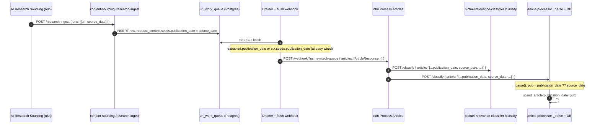

> **Status: shipped 2026-06-22.** All 7 implementation units landed. Both n8n workflows (AI Research Sourcing, Custom Site — Argus Media) ran end-to-end against the deployed services, articles flowed through `Process Articles` into the dashboard, and the email digest rendered cleanly. Follow-ups tracked in Todoist (Syntech BioFuel → Next Actions):
> 1. Weekly Anthropic VIP path — unverified; needs dashboard lens-config `vip_anthropic` flag.
> 2. AI Research lens label prettifier — cosmetic; awaiting feedback on whether `ai-research-<key>` reads as raw in the digest.
>
> Smoke notes: 27 Argus URLs → 24 articles flushed → in the digest. 3 AI Research lenses ran with the relative-date parser fix ("N days ago" parsing) and empty-urls IF gate (no false 422 Slack alerts). Zyte rate-limit fallback wired but unfired (Argus's API was responsive every run; will be exercised organically). Per-article `source_date → publication_date` fallback wired through all four services but not yet exercised end-to-end (most Argus pages extracted cleanly).

# feat: AI source-date passthrough + Custom Site URL intake

## Summary

Two coordinated tracks landed in one plan because they share the `/research-ingest` surface:

- **Track A — Source-date passthrough.** Carry the publication date Perplexity / Anthropic web_search return per result from AI Research Sourcing (n8n) through `/research-ingest` → `url_work_queue` (existing `request_context.seeds.publication_date` JSONB sidecar) → drainer flush → article-processor's `_parse()`. Use it as the fallback date when no other publication date is present. No new SQL column. No Alembic migration.
- **Track B — Custom Site — Argus Media.** A new n8n workflow that POSTs an external scraper's URLs to `/research-ingest` with `source_type: "Website"`. Widens `ResearchIngestRequest.source_type` from `Literal["AISearch"]` to `Literal["AISearch", "Website"]`. Establishes a `Custom Site — <Label>` naming convention and a standard tail (build payload → POST → respond) that future custom-site workflows inherit.

---

## Problem Frame

**Today.** AI Research Sourcing extracts dates from Perplexity / Anthropic results and uses them locally for a 14-day age-gate (`droppedNoDate` / `droppedOld` counters), then **discards them** when POSTing to `/research-ingest`. Articles whose downstream HTML date extraction fails appear "undated" in the dashboard + Notion. Separately, when clients ask for ad-hoc scraping of a specific website (`argusmedia.com` is the first), there's no n8n intake — every new site has been hand-coded.

**After.** AI Research Sourcing emits `{url, source_date}` per result. `/research-ingest` accepts the object form. The existing fallback wiring (`extracted.publication_date or ctx.seeds.publication_date` in content-sourcing's `app/queue/extract.py`) already routes the seed date into the final `ArticleResponse.publication_date` if HTML extraction yields nothing. The article-processor's `_parse()` is extended with one more fallback step (the inner JSON's `source_date` field) for the case where content-sourcing also fails to extract. The Argus workflow ships as the first proper `Custom Site — <Label>` instance.

---

## Requirements

| ID | Requirement | Origin |
|----|-------------|--------|
| R1 | AI Research Sourcing emits `urls: [{url, source_date}, ...]` instead of `urls: ["..."]` from both the daily Perplexity branch and the Anthropic fallback. | origin |
| R2 | `/research-ingest` in `syntech-content-sourcing` accepts the new `urls` object shape. `source_date` is optional ISO-8601. | origin |
| R3 | `request_context.seeds.publication_date` in `url_work_queue` carries the AI-supplied date through to the drainer's flush payload (no schema change — existing sidecar). | origin |
| R4 | `syntech-article-processor` reads `source_date` from the inner article JSON in `_parse()` and uses it as a fallback when `publication_date` is missing or unparseable. HTML-extracted / content-sourcing-extracted dates win when present. | origin |
| R5 | `syntech-biofuel-relevance-classifier` accepts `source_date` on its inbound request schema. This is the only `extra="forbid"` service in the pipeline; it is the deploy-order gate. | research (corrects origin) |
| R6 | `ResearchIngestRequest.source_type` widens from `Literal["AISearch"]` to `Literal["AISearch", "Website"]`. | research |
| R7 | A new n8n workflow `Custom Site — Argus Media` accepts a webhook payload `{urls: ["https://www.argusmedia.com/..."]}`, validates (https-only, `argusmedia.com` host, urls non-empty), POSTs to `/research-ingest` with `source_type: "Website"`, `source_name: "Argus Media"`, `source_category: "News"`, returns the content-sourcing response. | origin |
| R8 | The new workflow follows the `Custom Site — <Label>` naming convention: em-dash display name (`Custom Site — Argus Media`); hyphen filename (`Custom Site - Argus Media.workflow.ts`). Standard tail (build payload → POST → respond) is structured so future custom-site workflows can copy-paste it. | origin |
| R9 | End-to-end verification: a real Argus URL flows from the webhook through the pipeline; `source: "Website"`, `source_name`, `source_category` are preserved into the dashboard; the AI-supplied date round-trips when HTML extraction fails. | origin |

---

## Key Technical Decisions

### KTD1. `source_date` storage = existing `SeedMetadata.publication_date` JSONB field

`url_work_queue.request_context` is a JSONB sidecar already designed to carry per-URL metadata. `SeedMetadata` (`syntech-content-sourcing/app/queue/schema.py:21-34`) already has `publication_date: Optional[datetime]`, and `app/queue/extract.py:255` already does `extracted.publication_date or ctx.seeds.publication_date`. The plan only needs to plumb the per-URL date from `/research-ingest`'s new shape into `SeedMetadata.publication_date` at enqueue time.

**Alternative considered:** new SQL column on `url_work_queue`. Rejected — no query predicate requires it (we never `WHERE source_date > ...`), and the pgbouncer DDL coordination is unnecessary cost for a metadata field.

### KTD2. Break-change `/research-ingest` `urls` to object form

Today: `urls: list[str]`. New: `urls: list[UrlWithMetadata]` where `UrlWithMetadata = {url: str, source_date: Optional[str]}`. `source_date` optional, ISO-8601.

**Alternative considered:** dual-shape (accept either). Rejected — only one caller exists today (AI Research Sourcing); the new Argus workflow lands together. Coordinated cutover is cleaner than maintaining two shapes.

### KTD3. `biofuel-relevance-classifier` is the deploy gate

Research correction: `extra="forbid"` is enforced only in `syntech-biofuel-relevance-classifier/app/schemas.py`. `content-sourcing` and `article-processor` default to `extra="ignore"` and will silently swallow `source_date` until plumbed. The brainstorm's "lockstep across pipeline" framing collapses to: **classifier ships first or 422s; the rest can interleave**.

### KTD4. Article-processor fallback wires at `_parse()`, persists to existing `publication_date` column

`syntech-article-processor` (despite its directory name, internally still titled `syntech-article-classifier`) has no HTML extraction — it consumes a stringified-JSON article body in `app/classify.py:_parse()` and parses the `publication_date` string there. The `source_date` fallback wires in at `app/classify.py:62-69`, immediately after the existing `pub_raw → pub` block. No separate provenance column; AI-supplied dates land in the same `publication_date TIMESTAMPTZ` column. Provenance distinction is deferred.

### KTD5. Argus workflow enforces an `argusmedia.com` host allow-list at validation time

Default per the brainstorm. Easier to relax than tighten. Implemented as a regex on the URL host in the validation Code node. URLs failing the check return 4xx with a clear message.

### KTD6. Standard tail duplicated inline, not extracted to a subworkflow

N=1 today (Argus). Refactor to an Execute-Workflow subworkflow when N≥3. Until then, each new custom-site workflow copy-pastes the three standard-tail nodes.

### KTD7. Article-processor's `MentionRequest` extended for symmetry; mentions path included in scope

The brainstorm scoped the fallback to both News and Mentions paths. `app/schemas.py:MentionRequest` (`syntech-article-processor`) gets `source_date: Optional[str]`; `app/mentions.py:persist_mention` applies the same precedence (request `publication_date` wins, `source_date` is fallback). Both paths in scope; ship together.

### KTD8. Hash-pin drift test for `ResearchIngestRequest.source_type`

Borrowed verbatim from the 2026-04-22 source/author rollout (Appendix A in that plan). A unit test in `syntech-content-sourcing/tests/test_research_ingest.py` asserts the exact `Literal[...]` membership so a future widening or accidental narrowing fails CI loudly.

---

## High-Level Technical Design

### Sequence: source_date through the pipeline (Track A)



### Decision: which date wins?

| Layer | Has `publication_date`? | Has `source_date`? | Result | Rationale |
|-------|-------------------------|---------------------|--------|-----------|
| content-sourcing `extract_one` | yes (HTML extracted) | irrelevant | use extracted | per-article HTML truth |
| content-sourcing `extract_one` | no | yes (from seed) | use seed | AI fallback |
| content-sourcing `extract_one` | no | no | None | undated |
| article-processor `_parse` | yes (in inner JSON) | irrelevant | use existing | content-sourcing already decided |
| article-processor `_parse` | no | yes | use source_date | fallback when content-sourcing also failed |
| article-processor `_parse` | no | no | None | genuinely undated |

### Custom Site — Argus Media node layout (Track B)

```
[Webhook Trigger (bearer auth)]
        │
        ▼
[Code: Validate]  ── reject non-https, non-argusmedia.com hosts, empty urls
        │
        ▼
[Code: Build research-ingest payload]  ── shape {source_type:"Website", source_name:"Argus Media",
                                            source_category:"News", urls:[{url}, ...]}
        │
        ▼
[HTTP Request: POST /research-ingest]  ── httpBearerAuth, retryOnFail, onError continueErrorOutput
        │
        ▼
[Response: shape + return]  ── pass through content-sourcing's response + echo source_name
```

---

## Output Structure

No new directories. Files modified or created:

```
syntech-n8n-as-code/
  workflows/syntech_biofuels_granite_automations_app_stephen_a/personal/
    AI Research Sourcing.workflow.ts                          [modified — code nodes emit {url, source_date}]
    Custom Site - Argus Media.workflow.ts                     [NEW]
  prompts/                                                    [unchanged]

syntech-content-sourcing/
  app/
    models.py                                                 [modified — UrlWithMetadata, source_type widened]
    api/routes.py                                             [modified — thread source_date into seeds]
  tests/
    test_research_ingest.py                                   [modified — new urls shape + Website + drift test]
    test_queue_flush.py                                       [modified — source_date survives build_payload]

syntech-article-processor/
  app/
    classify.py                                               [modified — _parse() source_date fallback]
    schemas.py                                                [modified — MentionRequest.source_date]
    mentions.py                                               [modified — persist_mention precedence]
  tests/
    test_classify_parse.py                                    [modified — fallback scenarios]
    test_mentions.py                                          [modified — fallback scenarios]

syntech-biofuel-relevance-classifier/
  app/
    schemas.py                                                [modified — ClassifyRequest source_date]
  tests/
    test_classify_schema.py                                   [modified — accepts source_date]
```

---

## Scope Boundaries

### In scope

Everything in Requirements R1–R9 + KTDs above. Both Tracks A and B ship together.

### Deferred to Follow-Up Work

- **Provenance column distinguishing AI-supplied vs HTML-extracted dates.** No current consumer needs it. Add when reporting requires it.
- **Backfill of existing `publication_date = NULL` rows.** Forward-only by design. Re-running affected articles through AI Research Sourcing will not re-ingest them (dedup); a separate retroactive backfill plan is a follow-up if it becomes worth doing.
- **Subworkflow extraction of the Custom Site standard tail.** Trigger: third custom-site workflow.
- **Removing the 14-day age-gate in AI Research Sourcing.** Stays.
- **Notion-driven custom URLs DB.** Stephen confirmed Notion is out of scope for this intake mechanism.
- **n8n-side scraping / sitemap parsing inside the Argus workflow.** Custom site workflows accept URLs from external scrapers; n8n stays as orchestration, not scraping.
- **Updating `~/granite/clients/syntech/architecture.md` and this repo's `docs/ARCHITECTURE.md`** to reflect the new `urls` shape and the strict-gate correction. Tracked as a Documentation Plan item below; runs post-merge.

### Outside this product's identity

Nothing in this scope changes product identity.

---

## Implementation Units

### U1. `biofuel-relevance-classifier` — accept `source_date` (strict-gate deploy first)

**Goal:** Land `source_date: Optional[str]` on the classifier's inbound request schema so a downstream service that ships first does not 422 when upstream begins emitting the field.

**Requirements:** R5.

**Dependencies:** none.

**Target repo:** `syntech-biofuel-relevance-classifier`.

**Files:**
- `app/schemas.py` — add `source_date: Optional[str] = None` to the inbound request model. Confirm `extra="forbid"` is preserved.
- `tests/test_classify_schema.py` (or equivalent existing schema test file) — assert `source_date` is accepted; assert known-bad payload is still rejected.

**Approach:** This is a strictly additive optional field. The classifier does not need to *use* `source_date` for relevance — it just needs to accept it without 422. Keep parsing path unchanged.

**Patterns to follow:** Mirror the 2026-04-22 source/author rollout in this repo. Same shape: optional field, ConfigDict unchanged, hash-pin drift test if one already exists.

**Test scenarios:**
- Happy path: `source_date: "2026-06-18T10:00:00Z"` accepted, no exception, response shape unchanged.
- Happy path: `source_date` omitted → still accepted (Optional default `None`).
- Edge: empty string `source_date: ""` — define behaviour (recommend reject as invalid ISO-8601; document).
- Edge: malformed `source_date: "not-a-date"` — accepted by Pydantic (it's a string), but the classifier never parses it, so no runtime impact. Verify no crash.
- Failure path: unknown field still rejected (extra="forbid" preserved).

**Verification:** classifier accepts a request carrying `source_date` and a request omitting it; CI passes.

---

### U2. `article-processor` — `source_date` fallback in `_parse()` + DB persistence (News path)

**Goal:** When the inner article JSON lacks `publication_date` (or `pub_raw` fails to parse), read `source_date` from the same JSON and use it. Persist to the existing `publication_date` column.

**Requirements:** R4.

**Dependencies:** U1 (classifier must already accept `source_date` upstream so n8n's parallel calls to both services don't fan into a 422).

**Target repo:** `syntech-article-processor`.

**Files:**
- `app/classify.py` — extend `_parse()` (lines 49–100) to read `data.get("source_date")` and use it when `pub` is None after the existing `pub_raw → pub` block. Use the same `datetime.fromisoformat(... .replace("Z", "+00:00"))` tolerance.
- `app/db.py` — no change (column exists, `upsert_article` writes whatever datetime `_parse` produces).
- `tests/test_classify_parse.py` — add fallback test scenarios.

**Approach:** One additional fallback step. Existing precedence:
1. `data["publication_date"]` parsed → use.
2. (NEW) `data["source_date"]` parsed → use as fallback.
3. None → store NULL.

Do not introduce a separate provenance column. Do not change the dashboard outbox payload shape; `published_at` continues to mirror `publication_date`.

**Patterns to follow:** existing `pub_raw` block at `app/classify.py:62-69`. Same parsing tolerance. Same `_ParsedInput` dataclass.

**Test scenarios:**
- Both `publication_date` and `source_date` present → `publication_date` wins.
- Only `publication_date` present → use it.
- Only `source_date` present → use it.
- Neither present → `_ParsedInput.publication_date is None`.
- `publication_date` malformed, `source_date` valid → fall through to `source_date`.
- `source_date` malformed, no `publication_date` → `_ParsedInput.publication_date is None`, no exception.
- `source_date` is empty string → treated as missing.

**Verification:** running `tests/test_classify_parse.py` shows all new scenarios green; `upsert_article` smoke test confirms the fallback value reaches the column.

---

### U3. `article-processor` — `source_date` fallback for Mentions (`/mentions/analyze`)

**Goal:** Symmetric behaviour on the Mentions path: `MentionRequest.publication_date` wins; `source_date` is the fallback.

**Requirements:** R4 (Mentions parity).

**Dependencies:** U2 (same patterns, same precedence; ship in same PR if possible).

**Target repo:** `syntech-article-processor`.

**Files:**
- `app/schemas.py` — add `source_date: Optional[str] = None` to `MentionRequest` (lines 142–150).
- `app/mentions.py` — extend `persist_mention` (lines 144–210) with the same precedence at the parse site (lines 158–166).
- `tests/test_mentions.py` — add fallback scenarios. Extend `sample_mention_request` fixture (lines 21–30) to include the new field.

**Approach:** identical to U2. The Mentions path has no HTML extraction either; the precedence is request `publication_date` > request `source_date` > None.

**Test scenarios:**
- Both present → `publication_date` wins; persisted row reflects `publication_date`.
- Only `source_date` → use it; persisted row reflects `source_date`.
- Neither → NULL.
- Malformed `source_date` with no `publication_date` → NULL, no crash, no half-written row.

**Verification:** `tests/test_mentions.py` passes; mentions row in `mentions` table reflects expected precedence on a manual smoke call.

---

### U4. `content-sourcing` — break-change `/research-ingest` `urls` to object form + widen `source_type` Literal

**Goal:** Accept `urls: list[UrlWithMetadata]` instead of `urls: list[str]`. Widen `source_type` to `Literal["AISearch", "Website"]`. Thread per-URL `source_date` into `SeedMetadata.publication_date` at enqueue time. The drainer + extract path is already wired (`extracted.publication_date or ctx.seeds.publication_date`) so no further plumbing.

**Requirements:** R2, R3, R6.

**Dependencies:** U1, U2, U3 (downstream services must accept the new field before content-sourcing forwards it; U2/U3 also gate the n8n side at U6, so they must land first regardless).

**Target repo:** `syntech-content-sourcing`.

**Files:**
- `app/models.py` —
  - Define `class UrlWithMetadata(BaseModel): url: str; source_date: Optional[str] = None` with `_validate_url` re-applied (https + SSRF guard, mirroring the existing `_validate_urls` shape).
  - Change `ResearchIngestRequest.urls` from `list[str]` to `list[UrlWithMetadata]` (min_length=1, max_length=100).
  - Widen `ResearchIngestRequest.source_type` to `Literal["AISearch", "Website"]`.
  - Add `source_date: Optional[str] = None` to `ArticleResponse` so the field survives the queue → drainer → flush payload round-trip when present (this is the field that downstream consumes).
- `app/api/routes.py` — update `research_ingest()` (line 219) to map each `UrlWithMetadata` into a `DiscoveredURL` with `SeedMetadata.publication_date = url_item.source_date` (parsed to datetime if present).
- `app/queue/extract.py` — no change. Existing precedence already correct; verify ordering during code review.
- `tests/test_research_ingest.py` —
  - New tests for object-shape `urls` (happy path with `source_date`; happy path without; malformed `source_date`).
  - Drift test on `ResearchIngestRequest.source_type` (hash-pin the literal membership).
  - Existing string-shape tests deleted (break-change).
  - New `source_type="Website"` acceptance test.
- `tests/test_queue_flush.py` — assert `source_date` is present in `build_payload()` output when set; absent when not.

**Approach:** Single PR; the schema change and the route change must land together because they're a contract break. The `request_context.seeds.publication_date` field already exists in `SeedMetadata` and is already used as fallback in `extract_one` — verify path during PR review; do not re-engineer.

**Patterns to follow:** Mirror the inbound validation shape of `SearchRequest._validate_urls`. The 2026-04-22 PR's `feat: source/author field contract` for the additive-field cadence.

**Test scenarios:**
- Happy: `urls: [{url, source_date}]` with `source_type: "AISearch"` → 200, row enqueued, `request_context.seeds.publication_date` set.
- Happy: `urls: [{url}]` (no `source_date`) → 200, row enqueued, `request_context.seeds.publication_date` None.
- Happy: `urls: [{url}]` with `source_type: "Website"` → 200.
- Edge: `urls: [{url, source_date: "2026-06-18T10:00:00Z"}, {url, source_date: None}]` mixed batch → both rows enqueued correctly.
- Failure: `urls: ["http://..."]` (legacy string form) → 422 with informative error.
- Failure: non-https URL → 422 with SSRF guard message.
- Failure: `source_type: "Unknown"` → 422.
- Drift test: `ResearchIngestRequest.source_type.__args__` equals expected hash / explicit `("AISearch", "Website")` tuple.

**Verification:** all tests pass; `curl` smoke against staging accepts the new shape and rejects the old.

---

### U5. `n8n` — update AI Research Sourcing code nodes to emit `{url, source_date}`

**Goal:** Both daily (Perplexity) and fallback (Anthropic web_search) code nodes return `urls` as objects with `source_date` set from the existing per-result date logic. The 14-day age-gate stays.

**Requirements:** R1.

**Dependencies:** U4 (content-sourcing must accept the new shape before n8n starts sending it).

**Target repo:** `syntech-n8n-as-code` (this repo).

**Files:**
- `workflows/syntech_biofuels_granite_automations_app_stephen_a/personal/AI Research Sourcing.workflow.ts` — pull latest with `n8nac pull txdJXCYFkB1HCZtI` before editing. Update:
  - `Daily — Build Ingest Payload` code node — emit `urls: capped.map(u => ({url: u.url, source_date: u.sourceDate}))` (currently emits `capped` as bare URL strings). Preserve `droppedNoDate` / `droppedOld` counters. The age-gate logic and `pubMs` calculation stay.
  - `Fallback — Extract URLs` code node — same change for the Anthropic path.
  - `Daily — POST /research-ingest` HTTP node — `jsonBody` shape unchanged at the n8n level (it already serializes `$json.urls`), but verify the urls field flows the new shape, not strings.
  - `Fallback — POST /research-ingest` — same verification.

**Approach:** Both code nodes today collect dates into local variables (`pubStr`, `age`) and use them only for the age-gate. Refactor to keep that gate but also retain the date alongside the URL through to the final `urls` array.

**Patterns to follow:** Existing code-node style in the workflow (early-return, defensive checks, `for...of` over `items`).

**Test scenarios:** n8n doesn't unit-test code nodes; verification is by running the workflow with a manual trigger and inspecting node output in the editor:
- Click `Daily — Build Ingest Payload` after execution → output's `urls` field shows `[{url: "...", source_date: "2026-06-21T..."}]`.
- Click `Fallback — Extract URLs` after a forced fallback (set `Fallback Eligible? = true`) → same shape.
- `Daily — POST /research-ingest` HTTP node output shows 200; content-sourcing logs show enqueue success.

**Execution note:** Execute via the existing Manual Trigger (no email side-effect concern per the brainstorm — see Operational Notes below).

**Verification:**
- One manual run produces a non-empty `urls` array of objects.
- Spot-check one URL in the dashboard after the full pipeline runs: `publication_date` is populated with the AI-supplied date if content-sourcing did not extract one.

---

### U6. `n8n` — build `Custom Site — Argus Media` workflow

**Goal:** New webhook-triggered workflow that accepts a URL list and posts to `/research-ingest` with `source_type: "Website"`. Establishes the `Custom Site — <Label>` naming convention and the standard tail.

**Requirements:** R7, R8.

**Dependencies:** U4 (content-sourcing must accept `source_type: "Website"` on `/research-ingest`).

**Target repo:** `syntech-n8n-as-code` (this repo).

**Files:**
- `workflows/syntech_biofuels_granite_automations_app_stephen_a/personal/Custom Site - Argus Media.workflow.ts` — NEW.

**Approach:** Five-node workflow:
1. **Webhook Trigger** — bearer auth.
2. **Code: Validate** — assert `urls` non-empty; every URL is https and matches `^https://(www\.)?argusmedia\.com(/|$)`; reject with 4xx and clear message otherwise.
3. **Code: Build research-ingest payload** — `{source_type: "Website", source_name: "Argus Media", source_category: "News", urls: items.map(u => ({url: u}))}`. `source_date` deliberately omitted — Argus URLs from external scrapers don't carry dates.
4. **HTTP Request: POST `/research-ingest`** — `httpBearerAuth` credential (matching the AI Research Sourcing convention; reuse the existing AI_RESEARCH_INGEST_API_KEY credential), `retryOnFail: true, maxTries: 3, waitBetweenTries: 5000`, `onError: 'continueErrorOutput'`, explicit `Content-Type: application/json`, `X-Request-Id: {{$execution.id}}`.
5. **Code: Respond** — pass through content-sourcing's response + echo `source_name`; on error-output branch, return 502 with the upstream error.

**Patterns to follow:** AI Research Sourcing's POST node configuration (`docs/solutions/2026-n8n-to-microservice-cutover.md`-aligned). Existing bearer credential pattern (memory: `feedback_n8n_bearer_auth` — use `httpBearerAuth`, not `httpHeaderAuth`).

**Test scenarios:**
- Happy: `{urls: ["https://www.argusmedia.com/news/article-1", "https://www.argusmedia.com/news/article-2"]}` → 200, two rows enqueued.
- Happy: re-post the same URLs → content-sourcing dedup returns the existing rows, response reflects dedup count.
- Failure: empty `urls` → 4xx, no upstream call.
- Failure: non-https URL → 4xx, no upstream call.
- Failure: non-`argusmedia.com` host → 4xx with `host-not-allowed` message, no upstream call.
- Failure: upstream `/research-ingest` returns 5xx → workflow returns 502 with upstream error in body; verify n8n retry-then-fail behaves.

**Verification:** `npx n8nac push` the new file; `npx n8nac verify <id>`; `npx n8nac workflow activate <id>`; `npx n8nac test <id> --prod --data '{"urls":["https://www.argusmedia.com/news/some-real-url"]}'`. Confirm row appears in `url_work_queue` with `source: "Website"`, `source_name: "Argus Media"`, `source_category: "News"`. Inspect dashboard after drainer flush.

---

### U7. End-to-end verification + Documentation updates

**Goal:** Verify both tracks live; update the two architecture docs to reflect new `urls` shape and the corrected `extra="forbid"` strict-gate scope.

**Requirements:** R9, plus the documentation entry in Scope Boundaries.

**Dependencies:** U1–U6 deployed.

**Target repo:** `syntech-n8n-as-code` (this repo) for the doc updates; cross-repo for the smoke runs.

**Files:**
- `docs/ARCHITECTURE.md` — update the `/research-ingest` section to reflect `urls: list[{url, source_date?}]` and the widened `source_type` Literal. Note the `Custom Site — <Label>` naming convention as a discoverable pattern.
- `~/granite/clients/syntech/architecture.md` — same updates, plus an "Invariant 6" or footnote correcting "Pydantic `extra="forbid"`" to apply only to `syntech-biofuel-relevance-classifier`.

**Approach:** Run two smoke flows after all upstream deploys land. Capture observed behaviour in this plan's "Verification" section comment or in a brief notes file before merging the doc edits.

**Test scenarios:** (manual end-to-end, not automated)
- **AI Research smoke.** Trigger AI Research Sourcing manually. Verify in the dashboard within the drainer cycle that articles whose downstream extraction returned no date now carry the AI-supplied `publication_date`. Cross-check at least one Notion-side entry. Compare to a known undated article from a prior run as control.
- **Argus smoke.** Curl the new webhook with 5 real Argus URLs. Verify 5 rows in `url_work_queue` (or fewer if duplicates), all with `source: "Website"`, `source_name: "Argus Media"`. Verify they survive classification + processing and appear in the dashboard. Confirm none are flagged as `source: "AISearch"` or any other accidental relabel.

**Execution note:** Per Stephen's testing strategy: temporarily remove the team distribution email from email-digest Railway env vars before running smokes so only Stephen receives the digest, then restore. Run smokes outside the once-per-day digest + monitor cron window. No special `source_name` tagging — AI Research Sourcing has not run in multiple days, so any AI-sourced article in the DB between deploy start and going live is, by construction, a test artifact.

**Verification:** both smokes pass; doc updates merged.

---

## Dependencies & Sequencing

```
U1 (classifier accepts source_date)   ──┐
                                         ├──> U4 (content-sourcing accepts new shape + Website) ──> U5 (n8n AI Research emits objects)
U2 + U3 (article-processor fallback) ──┘                                                       └──> U6 (Argus workflow)
                                                                                                       │
                                                                                                       ▼
                                                                                                      U7 (smoke + docs)
```

**Deploy order (strict):**

1. U1 — classifier first (it's the only `extra="forbid"` service; it would 422 if n8n started sending `source_date` before it accepts it).
2. U2 + U3 — article-processor (lenient `extra="ignore"`, but the persistence wiring needs to be live or the AI date is silently dropped on the floor).
3. U4 — content-sourcing (the contract break; lands before n8n flips to the new shape).
4. U5 — n8n AI Research Sourcing code nodes emit the new shape.
5. U6 — Custom Site — Argus Media workflow ships.
6. U7 — smokes + doc updates.

U2 and U3 can be one PR. U5 and U6 can be a single n8n batch push.

---

## Risks & Dependencies

| Risk | Mitigation |
|------|------------|
| Deploy-order misorder leaves classifier 422-ing on real traffic | Strict order above. Smoke-test classifier acceptance of `source_date` immediately after U1 deploys but before U5 ships. |
| `url_work_queue` rows in flight at content-sourcing deploy time carry no `source_date` and were enqueued under old code | Acceptable. The drainer extracts these rows with the existing precedence (`extracted.publication_date or ctx.seeds.publication_date`); old rows have `seeds.publication_date = None`, so they simply rely on HTML extraction as today. No 422 risk because the drainer's outbound payload is built from `ArticleResponse`, not a strict inbound schema. |
| `/research-ingest` shape change rejects AI Research Sourcing requests during the brief U4→U5 window | The two ship close together. Recommended cadence: U4 deploy → verify the AI Research scheduled cron is paused or off-cycle → U5 push to n8n → re-enable. Alternative for tighter safety: ship U4 with dual-shape acceptance, then deprecate the string form after U5 lands. Plan default is single-shape break per KTD2; revisit if the deploy window slips. |
| Argus host allow-list too strict (rejects legitimate Argus subdomains or path moves) | Regex `^https://(www\.)?argusmedia\.com(/|$)` allows the canonical apex + www. If Argus uses other subdomains for actual articles (e.g. `direct.argusmedia.com`), broaden the regex during U6. |
| Hash-pin drift test breaks future legitimate widening of `source_type` | By design — the test should fail loudly. Updating the literal *and* the drift test together in the same PR is the correct cadence. |
| n8n `n8nac push` last-write-wins clobbers a pending UI edit | Stephen has not edited AI Research Sourcing in the UI recently; verify with `n8nac list` before push. The new Argus file is greenfield — no contention. |
| Dashboard or email-digest UI assumes `publication_date` was HTML-extracted and surfaces stale dates as "today" | Visual check during U7 smoke. No code change needed; rendering already handles arbitrary timestamps. |

---

## Operational / Rollout Notes

**Email-side testing strategy (per brainstorm):**
- Before U5/U6 smoke runs, temporarily remove the team's distribution email from email-digest Railway env vars so only Stephen receives the digest. Restore after going live.
- Run smokes outside the once-per-day digest + monitor cron window.
- No special `source_name` tagging on test ingests. The implicit test window — "AI Research has not run in multiple days, so any AI-sourced row from today is a test artifact" — is sufficient.

**Per-phase rollback (mirrors the 2026-04-22 source/author plan Appendix D):**
- U1 rollback: revert classifier schema PR; no data implications.
- U2/U3 rollback: revert article-processor PR; `source_date` continues to arrive on the wire but is ignored (`extra="ignore"`).
- U4 rollback: revert content-sourcing PR; `/research-ingest` returns to `list[str]` shape. Must roll back U5 in the same window or AI Research 422s.
- U5 rollback: re-pull AI Research Sourcing workflow, revert code-node changes, re-push. The workflow's output reverts to `urls: list[str]`.
- U6 rollback: `n8nac workflow deactivate <id>` on the Argus workflow; delete the file from local + remote.

**Adding the next custom-site workflow (runbook):**
1. Copy `workflows/.../Custom Site - Argus Media.workflow.ts` to `Custom Site - <NewSiteLabel>.workflow.ts`.
2. Rename the workflow display name to `Custom Site — <NewSiteLabel>` (em-dash).
3. Update the host allow-list regex in the Validate node.
4. Update `source_name` and (if needed) `source_category` defaults in the Build payload node.
5. `n8nac push` → `verify` → `activate` → smoke-test.

---

## Documentation Plan

Tracked in U7:
- `docs/ARCHITECTURE.md` (this repo) — `/research-ingest` shape, `Custom Site — <Label>` convention.
- `~/granite/clients/syntech/architecture.md` — same plus the `extra="forbid"` correction.

A separate `docs/solutions/` entry should capture the institutional lesson "`extra="forbid"` is per-service, not pipeline-wide; do not extrapolate the invariant from one repo's CLAUDE.md" — recommended after merge; out of scope for this plan.

---

## Open Questions

- **`source_date` empty string vs absent — define normative behaviour.** Recommendation: Pydantic accepts the empty string at the wire level; treat it as missing in `_parse()` (already the case for `pub_raw`). Confirm during U2 review.
- **Argus subdomain coverage.** Verify during U6 build that all real Argus article URLs sit under the canonical apex / www. If a subdomain is required, broaden the regex.
- **Should U7 also reach into `syntech-intelligence-dashboard`?** The dashboard reads `publication_date` from the DB — no schema change. But if there's a hardcoded source-list filter that omits `Website`, the new Argus rows would not surface. Quick grep during U7 sufficient; full repo change deferred unless found.

---

## Sources & Research

- Origin brainstorm: `docs/brainstorms/2026-06-22-ai-search-debug-and-custom-url-intake-requirements.md`.
- Prior coordinated rollout (template): `docs/plans/2026-04-22-001-feat-source-author-field-contract-plan.md` and its origin brainstorm `docs/brainstorms/2026-04-22-source-author-field-contract-requirements.md`.
- Architecture: `~/granite/clients/syntech/architecture.md` (pipeline + invariants), this repo's `docs/ARCHITECTURE.md` (local diagram + endpoint contracts).
- Related solutions:
  - `~/syntech-intelligence-dashboard/docs/solutions/architecture-patterns/ai-research-sourcing-2026-06-17.md` (`/research-ingest` defense-in-depth, original AISearch cross-repo enum sweep, dedicated `AI_RESEARCH_INGEST_API_KEY`).
  - `docs/solutions/2026-n8n-to-microservice-cutover.md` (n8n HTTP Request conventions: bearer + retry + onError).
  - `~/syntech-intelligence-dashboard/docs/solutions/integration-issues/source-type-enum-mismatch-content-sourcing-api-2026-05-19.md` (cross-repo enum drift surfaces as 422).
- Research findings:
  - `syntech-content-sourcing/app/models.py` — `ResearchIngestRequest`, `ArticleResponse`; `app/queue/schema.py` — `SeedMetadata.publication_date`; `app/queue/extract.py` line 255 — existing fallback wiring.
  - `syntech-article-processor/app/classify.py` — `_parse()` lines 49–100, fallback wire-in site at lines 62–69; `app/schemas.py` — `MentionRequest`; `app/mentions.py` — `persist_mention`.
  - `syntech-biofuel-relevance-classifier/app/schemas.py` — `extra="forbid"` is enforced here (and only here in the pipeline).
- Memories:
  - `feedback_n8n_bearer_auth` — use `httpBearerAuth`, not `httpHeaderAuth`.
  - `output_fields_are_schema` — output field changes affect downstream; coordinate.
  - `feedback_source_vs_author` — `source` is the platform, never the author.
  - `feedback_classification_labels` — canonical first-seen label is `new`.
